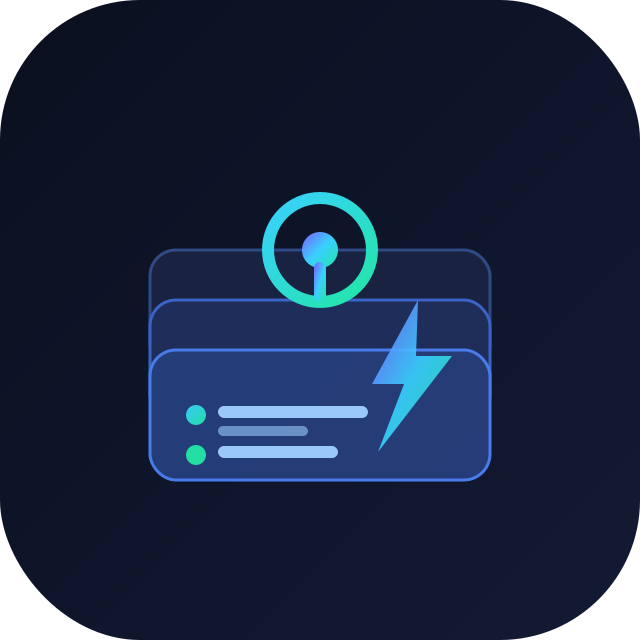
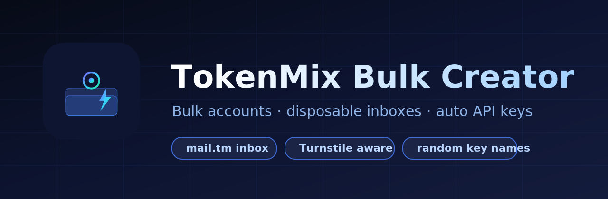

<p align="center"><a href="../README.md">
  
</a></p>

<p align="center"></p>

<p align="center"><a href="https://www.python.org/"></a> <a href="https://playwright.dev/"></a> <a href="../LICENSE"></a>  </p>

# TokenMix Bulk Account Creator

> Buat akun TokenMix secara massal dengan inbox sekali pakai dan pembuatan API key otomatis bernama acak.

<p><a href="../README.md">English</a> · <strong>Indonesia</strong> · <a href="README.zh.md">简体中文</a> · <a href="README.ja.md">日本語</a> · <a href="README.ko.md">한국어</a> · <a href="README.es.md">Español</a></p>

---

## Mengapa pakai browser?

TokenMix melindungi pendaftaran dengan tantangan **Cloudflare Turnstile**. Klien HTTP biasa akan ditolak, sehingga proyek ini mengendalikan browser asli via Playwright, menyelesaikan tantangan secara alami, lalu menjalankan panggilan REST terautentikasi dari dalam konteks browser tersebut.

## Fitur

- Inbox mail.tm sekali pakai untuk setiap akun
- Sadar Turnstile dengan token sekali pakai
- Username, kata sandi, dan nama key yang acak
- API key otomatis bernama seperti `prod-swift-falcon-a1b2`
- Output JSON + CSV bertahap (aman jika berhenti)
- Konkurensi opsional dan percobaan ulang per akun

## Instalasi

```bash
git clone https://github.com/0xgetz/tokenmix-bulk-creator.git
cd tokenmix-bulk-creator
python -m venv .venv && source .venv/bin/activate
pip install -e .
playwright install chromium
```

## Mulai cepat

**Satu akun, browser terlihat**

```bash
tokenmix-bulk --count 1
```

**Lima akun, prefix khusus**

```bash
tokenmix-bulk -n 5 --key-prefix prod
```

**Batch headless dengan worker**

```bash
tokenmix-bulk -n 10 -c 2 --headless
```

**File konfigurasi**

```bash
tokenmix-bulk --config config.example.json
```

## Keluaran

Setiap proses menulis `accounts.json` dan `accounts.csv` berisi email, kata sandi, API key, dan status tiap akun.

## Memakai API key

TokenMix kompatibel dengan OpenAI, base URL `https://api.tokenmix.ai/v1`.

```bash
curl https://api.tokenmix.ai/v1/chat/completions \
  -H "Authorization: Bearer sk-tm-..." \
  -H "Content-Type: application/json" \
  -d '{"model":"gpt-4o","messages":[{"role":"user","content":"hello"}]}'
```

## Pengembangan

```bash
pip install -e ".[dev]"
python -m pytest
```

## Lisensi

Dirilis di bawah Lisensi MIT.
